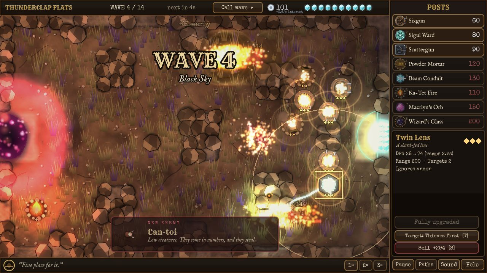
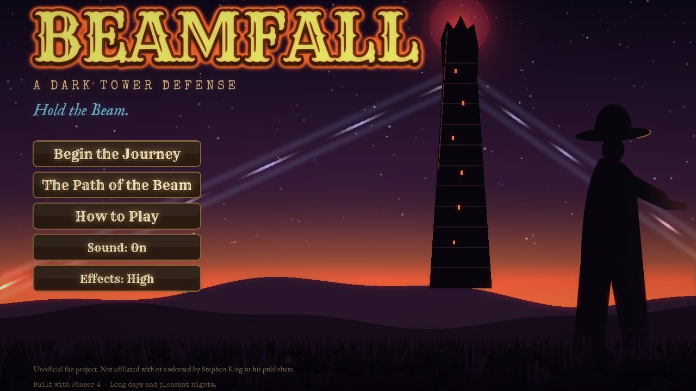
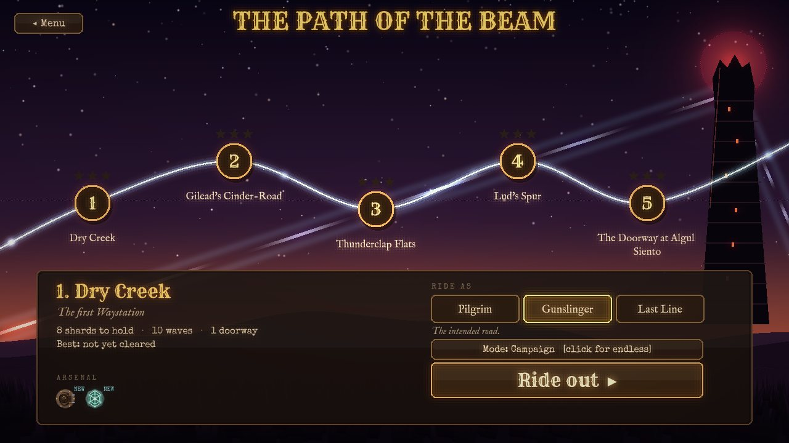

# BEAMFALL — a Dark Tower defense grid

> *Hold the Beam.*

A tower-defense game in the spirit of **Defense Grid: The Awakening**, set in the world of the **Dark Tower**,
built on **Phaser 4** (WebGL).

You are Wren Calloway, the last 'prentice of a dead order, holding a string of ruined Waystations along the
Path of the Beam. The servants of the Crimson King pour out of a *thinny* — a place where the world has worn
through — to **steal the Beam-shards** that nail the Beam to the ground. Every shard that walks back through the
Doorway is a piece of the Beam gone for good. Build gunslinger posts, shape the road the Red Tithe must walk, shoot the
thieves before they escape, and keep the Tower standing.

*Unofficial fan project. Not affiliated with or endorsed by Stephen King or his publishers. The storyline and characters
are original; the world is borrowed with love. See [`docs/DESIGN.md`](docs/DESIGN.md) for the story bible and the
reasoning behind every mechanic.*

<p align="center">
  <br>
   
</p>

**Working on this?** [`CONTRIBUTING.md`](CONTRIBUTING.md) has the setup, checks and conventions;
[`docs/GFX_GUIDE.md`](docs/GFX_GUIDE.md) is the guide for adding art, details and effects.

---

## Play

```bash
npm install
npm run dev        # http://localhost:5173
```

```bash
npm run build      # production bundle in dist/
npm run preview
```

Every push to `main` is tested, built and deployed to GitHub Pages by `.github/workflows/pages.yml`
(live at <https://knotenvy.github.io/KnotzDefenseGrid/> once the first deploy finishes).

Needs a browser with **WebGL** (any current desktop browser). There are **no binary assets**: sprites are SVG,
terrain is painted at boot, and every sound and the music are synthesised.

### Controls

| | |
|---|---|
| **Click a post** (or **1–8**), then click the ground | Build (2×2 cells). Right-click / Esc cancels |
| Click a built post | Select: **U** upgrade · **S** sell · **T** cycle targeting |
| **Space** | Call the next wave early (bonus silver) |
| **F** | Cycle game speed 1× / 2× / 3× |
| **H** | Show the enemy path |
| **P** / **Esc** | Pause |
| **M** | Mute |

URL switches for testing: `?level=3` (jump to a level), `?all` (all posts unlocked), `?unlock` (all levels open),
`?silver=2000`, `?wave=1` (seconds to the first wave), `?fx=low|high`, `?endless`, `?diff=easy|normal|hard`, and for lighting
work `?amb=ffffff` (ambient colour) and `?sun=0..2` (sun intensity).

### How it plays (Defense Grid DNA)

* The Red Tithe comes through a **Doorway**, walks to your **Waystation**, grabs a **shard** and *runs back out the
  same Doorway*. **Kill the carrier**: the shard drops, and (unless another thief grabs it) drifts home.
* A 32×20 grid, 2×2 posts, flow-field pathing. **Posts reshape the road** — lengthen it, never seal it (the game refuses
  a build that would cut a Doorway off).
* **Interest** on banked silver, 3-tier upgrades, 70% sell refund, early-wave bonus, 1×/2×/3× speed.
* **Armor** blunts small bullets, so mix posts. **Flyers** ignore your maze. **Breakers** heal. **Bosses** break rules.

### The posts

| Post | What it does |
|---|---|
| **Sixgun** | Fast single-target hitscan. Dual-wield at tier 3 |
| **Sigul Ward** | Slow aura (stones carved by Mercy) |
| **Scattergun** | Short-range cone burst, great vs swarms, knockback at tier 3 |
| **Powder Mortar** | Lobbed splash shells that lead their target; ground only |
| **Beam Conduit** | A shard-fed lens that ramps up on a held target and ignores armor |
| **Ka-Tet Fire** | A campfire; nearby posts hit harder, farther, faster |
| **Maerlyn's Orb** | Chain lightning (halves armor, stuns at tier 3) |
| **Wizard's Glass** | Periodic time-stop pulse; frozen enemies take extra damage |

Five Waystations (Dry Creek → Gilead's Cinder-Road → Thunderclap Flats → Lud's Spur → The Doorway at Algul Siento)
with a boss at Thunderclap (**the Iron Bear**) and the finale (**Corvin Ashe**, who hexes your posts).
Three difficulties: Pilgrim / Gunslinger / Last Line. Clear the finale to unlock **The Wheel Turns**: endless, escalating waves on any Waystation (best waves-held is saved per map).

---

## Phaser 4 showcase

BEAMFALL is deliberately a tour of what Phaser 4's renderer can do:

| Phaser 4 feature | Where |
|---|---|
| **Dynamic lighting** (`setLighting`, point lights) | Terrain, boulders, posts, enemies, particles and GPU layers are all lit. Every shot throws a flash light; campfires flicker; the Waystation and Doorways glow |
| **Normal-mapped terrain** | `art/terrain.js` paints a level's ground and a matching normal map, so muzzle flashes rake across the relief |
| **SpriteGPULayer** | 1,300 devil-grass tufts (menus: stars + foreground grass) animated *entirely on the GPU* in one draw call |
| **Gradient game object** | Sky, Doorway portals and ripples, the Waystation beacon, the Beams in the sky |
| **Noise game objects** (`noisesimplex2d`) | Drifting fog banks and cloud shadows (colour + alpha ramps); a live noise field renders to a texture to drive the thinny ripple |
| **Camera Filters** | Hand-built bloom (`ParallelFilters` + `Threshold` + `Blur`), `ColorMatrix` grade, `Vignette`, a red `ColorMatrix` danger wash |
| **Localized filters** (`ParallelFilters` + `Mask`) | Doorway "thinny" ripple (`Displacement`) and the Wizard's Glass negative, each confined to a circle |
| **Object Filters** | `Glow` on the selected post and the title text |
| **Particles** | Lit emitters, emit zones, particle callbacks (the portal vortex), per-effect shared emitters with `emitParticleAt` |
| **RenderTexture** | Persistent scorch and ichor decals |
| **Grid shape** | The build-grid overlay |
| **Camera effects, Tweens, Time** | Shake, flash, fade, zoom drift, banners, floating text |
| **Scene management** | Separate HUD scene with its own (unfiltered) camera; persistent progress |

Notes from the trenches (useful if you build on Phaser 4):

* Phaser 4's stock `Threshold` also thresholds **alpha**; blended `ADD` it pushes the frame alpha to 2.0 and the next filter
  halves your picture. The bloom here thresholds RGB only and zeroes alpha.
* `Vignette` blends by `sin(d/radius·π·strength)`: a subtle vignette needs a *small* strength (≈0.1).
* Camera `fade`/`flash` are drawn **before** camera filters run, so they get bloomed and graded too.
* Factory names are lowercase (`noisesimplex2d`, `spriteGPULayer`); the shipped skill docs say otherwise in places.

---

## Architecture

```
src/
  sim/          Pure JS, no Phaser, deterministic (seeded RNG). Unit-tested.
    grid.js       cells, occupancy, Dijkstra flow fields, build validation
    sim.js        waves, thieves/shards, posts, bosses, economy
    data/         posts, enemies, levels (rectangle-op maps + wave scripts), lore
  game/         The Phaser view
    scenes/       Boot, Menu, Story, Select, Game, Hud, Result
    world/        terrain, grass, doorways, atmosphere
    entities/     PostView, EnemyView, ShardView
    fx/           Fx (events -> particles/lights/sound), PostFx (camera filters)
    art/          SVG sprites, terrain painter, texture baking
    audio/        Sfx: synthesised effects + generative music
    ui/           HUD kit, backdrop, flow helpers
  main.js
test/
  *.test.mjs                     node:test unit tests
  bot.mjs                        headless heuristic player (balance tuning)
  e2e.mjs                        Playwright end-to-end smoke test
tools/                           GFX dev tools: sprite sheet, review screenshots, perf probe, terrain preview, shared lib
docs/                            DESIGN.md (story bible + mechanics), GFX_GUIDE.md, README screenshots
old/                             the archived first prototype (Python/Pygame), reference only
```

The simulation is a fixed-step state machine; the Phaser layer reads its state each frame and reacts to its events
(`shot`, `blast`, `shardDrop`, …). That split is what makes the pathing and economy unit-testable, lets a **bot play every
level headlessly for balance**, and keeps presentation free to change.

### Tests

```bash
npm test                    # unit tests: grid/pathing, shards, economy, determinism, bosses, endless waves, audio synthesis
npm run bot                 # headless bot plays all levels      (node test/bot.mjs 3 --hp 2 --seeds)
npm run e2e                 # Chromium: menu -> map -> every level -> bosses -> real mouse/keyboard -> endless -> win -> results -> defeat
```

`bot.mjs` sweeps difficulty (`--hp 1.5`, `--lazy 0.6`, `--seeds`) and is how each level's `hp` multiplier was tuned so
that the margin shrinks from ~3× on level 1 to ~1.5–2× on level 5.

### Effects quality

Menu → *Effects: High/Low* (or `?fx=low`). Low drops bloom, fog, cloud shadows and the lens effects, and thins the grass.

### Known limitations

* Frame rate on real GPUs is unmeasured: development happened in a headless container where WebGL runs in software
  (~2 fps). The full-screen effects (bloom, noise fog, lens filters) are the expensive part; *Effects: Low* removes them.
* Balance was tuned with a heuristic bot, not human playtests. Expect the numbers in `src/sim/data/` to need a pass.
* The audio is fully synthesised and covered by sanity tests, but nobody has *listened* to it yet.
* Touch input works for building/selecting, but there is no right-click equivalent for cancelling (tap the active post button again).
